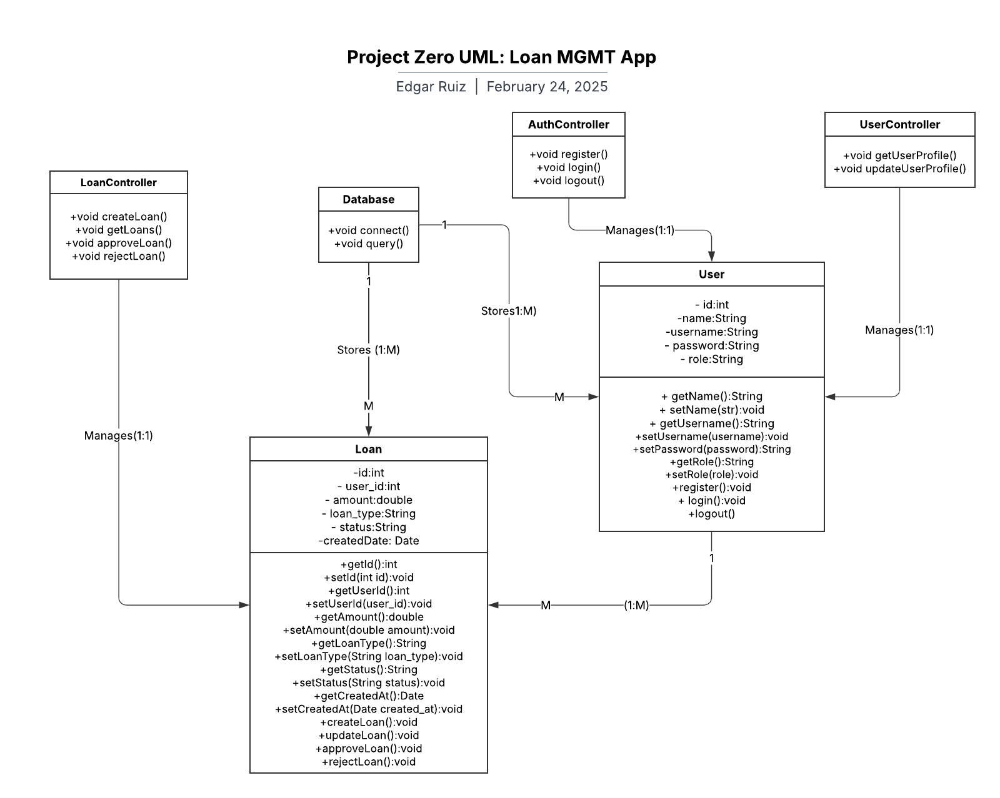
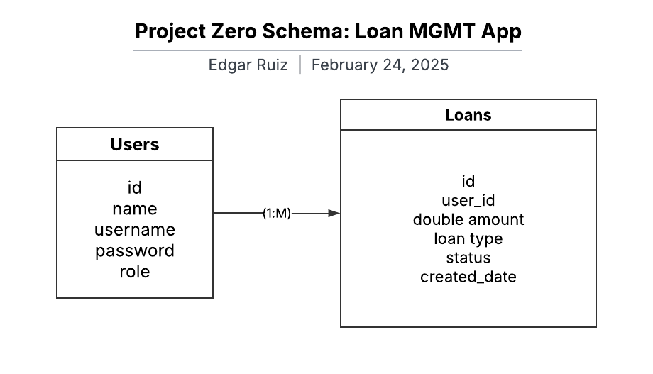
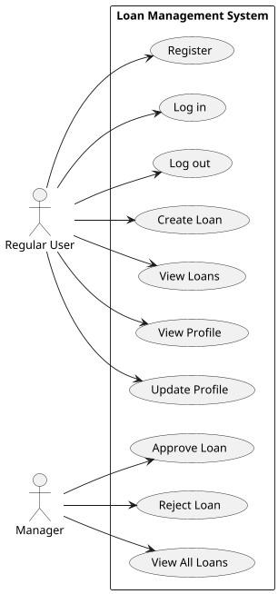

## **Iteration 1 (Project 0) — Loan Management System**
Author: Edgar Ruiz Dorador 
### **Goal**  
Create a RESTful back-end application using **Java 17**, **JDBC**, and **Javalin**, where users must **log in** to access protected endpoints. Certain endpoints are restricted to **manager** users (with additional permissions: approving or rejecting loans). You will test all endpoints via Postman (or a similar tool)—there is no dedicated front-end.

### **Key Features**

1. **User Registration & Authentication**  
   - **Create new user accounts** (registration endpoint).  
   - **Log in** with valid credentials to establish a session (cookie-based or token-based).  
   - **Log out** to end the session.  
   - **Roles**:  
     - **Regular User**: Can create and manage their own loans.  
     - **Manager**: Can view **all** loans, approve or reject them.  
   - Store roles in the database (e.g., a `role` column in your `users` table).

2. **User Profile Management**  
   - Once logged in, users can:
     - View or update **their own** profile.
     - (Optional) Delete **their own** account.

3. **Loan Applications**  
   - **Regular User** Capabilities:
     - Create a **new** loan application.
     - View or edit **their own** loan applications.
   - **Manager** Capabilities:
     - View **all** loan applications (not just their own).
     - **Approve** or **reject** any loan application.
   - Data fields might include: amount requested, loan type, status (e.g., *pending*, *approved*, *rejected*), etc.

4. **Data Persistence**  
   - Use **JDBC** to interact with a **PostgreSQL** database.
   - Store user details (including **hashed passwords** and roles) in a `users` table.
   - Store loan applications in a `loans` (or similarly named) table.
   - Ensure data integrity—only the correct user or a manager can modify certain records.

5. **API Endpoints with Javalin**  
   - Provide RESTful endpoints (e.g., `/auth/register`, `/auth/login`, `/auth/logout`, `/users`, `/loans`).
   - Protect endpoints using sessions:
     - **Logged-in** check for basic user actions (view/edit own loans).
     - **Manager** check for managerial actions (view all loans, approve/reject).
   - Common endpoints might include:
     - **POST** `/auth/register` – Register a new user.
     - **POST** `/auth/login` – Log in a user.
     - **POST** `/auth/logout` – Log out the current session.
     - **GET** `/users/{id}` – Get user info (user can only see their own, or manager can see any user—optional).
     - **PUT** `/users/{id}` – Update user profile (only if it’s the same user or a manager—optional).
     - **POST** `/loans` – Create a loan (logged-in user).
     - **GET** `/loans` – View all loans (manager only) or just the user’s loans (regular user). You can implement this in two separate endpoints or a single endpoint with conditional filtering.
     - **GET** `/loans/{loanId}` – View a specific loan (owner or manager).
     - **PUT** `/loans/{loanId}` – Update the loan (owner or manager).
     - **PUT** `/loans/{loanId}/approve` – Approve a loan (manager only).
     - **PUT** `/loans/{loanId}/reject` – Reject a loan (manager only).

---

### **Additional Requirements**

1. **Service Layer Unit Testing (using JUnit)**  
   - The **service layer** must include unit tests (2 minimum) that validate your **business logic** (e.g., loan creation, role checks, etc.).  
   - For example, you should test scenarios like:
     - Creating a loan with invalid data (should throw an exception or return an error).
     - Approving a loan as a manager vs. a regular user (checking role constraints).
     - Retrieving or updating loans only for the logged-in user (if not a manager).  
   - Use **JUnit** (version 5) to write these tests. Ensure they run successfully (`mvn test` or IDE tools).

2. **Logging (using Logback)**  
   - Implement **Logback** (with SLF4J) to log application flow and significant events. At minimum:
     - **INFO**-level logs for major actions (e.g., new user registration, new loan creation, loan approval).  
     - **WARN**-level logs for suspicious or invalid actions (e.g., unauthorized access attempts).  
     - **ERROR**-level logs for exceptions or critical failures (e.g., database errors, unexpected exceptions).  
   - Provide a simple `logback.xml` configuration or rely on default Logback settings.  
   - Log in the **service** and/or **DAO** layers as appropriate—particularly around business logic and data access.
   - Append to the console and/or file.

---

### **Technologies**

- **Java 17**  
- **Javalin** (for REST APIs and session management)  
- **JDBC** (for database connectivity)  
- **PostgreSQL** (database)  
- **JUnit 5** (unit testing)  
- **Logback** (logging)  
- **Postman** (for endpoint testing)

---

### **Project Structure**

1. **Controller/Handler Layer (Javalin)**  
   - Endpoints for authentication, user profile management, and loan handling.
   - **Role-based** access control: check if the user is logged in and (if needed) is a manager before allowing certain endpoints.

2. **Service Layer**  
   - **Authentication & Authorization**: 
     - Validate credentials.
     - Check user’s role (manager vs. user).
   - **Business Logic**:
     - Creating/updating loans (e.g., new or existing).
     - Approving/rejecting loans (manager only).
   - **Validation** (e.g., ensure loan request fields are valid).
   - **Unit Tests Required**: 
     - Use **JUnit** to cover core methods (e.g., createLoan, updateLoan, approveLoan).
     - Mock the **DAO** as needed, or use an in-memory approach for testing.

3. **Data Access Layer (DAO)**  
   - JDBC-based CRUD operations for:
     - **Users** (including retrieving user by username for login, storing hashed passwords, user role).
     - **Loans** (inserting new applications, updating status, retrieving by user or by ID, retrieving all for managers).
   - Incorporate **Logback** logs around data operations (e.g., error logs if a query fails).

---

### **Deliverables**

1. **Git Repository** with:
   - Java source code:
     - **Javalin** setup (controllers, handlers, session/role checks).
     - **Service** classes (with **JUnit tests**).
     - **DAO** classes.
   - SQL scripts (or instructions) to create the `users` and `loans` tables.
   - A **README** describing:
     1. How to run the application (via Maven or a `java -jar` command).  
     2. Database connection/configuration details.  
     3. **Instructions for running unit tests** (e.g., `mvn test`).  

2. **Postman Collection** (useful for presentations):
   - Demonstrating registration, login, logout.
   - Loan creation, viewing, editing (for users).
   - Manager actions (view all loans, approve/reject).
---
### **Project Zero Desing**

